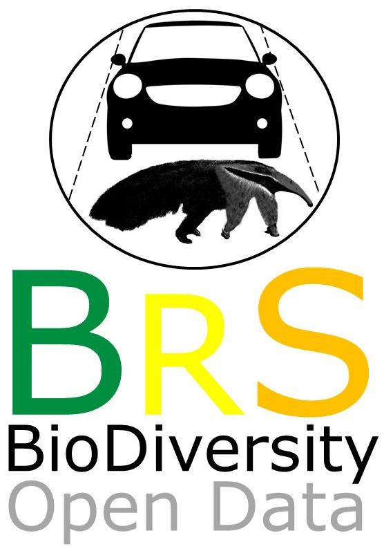
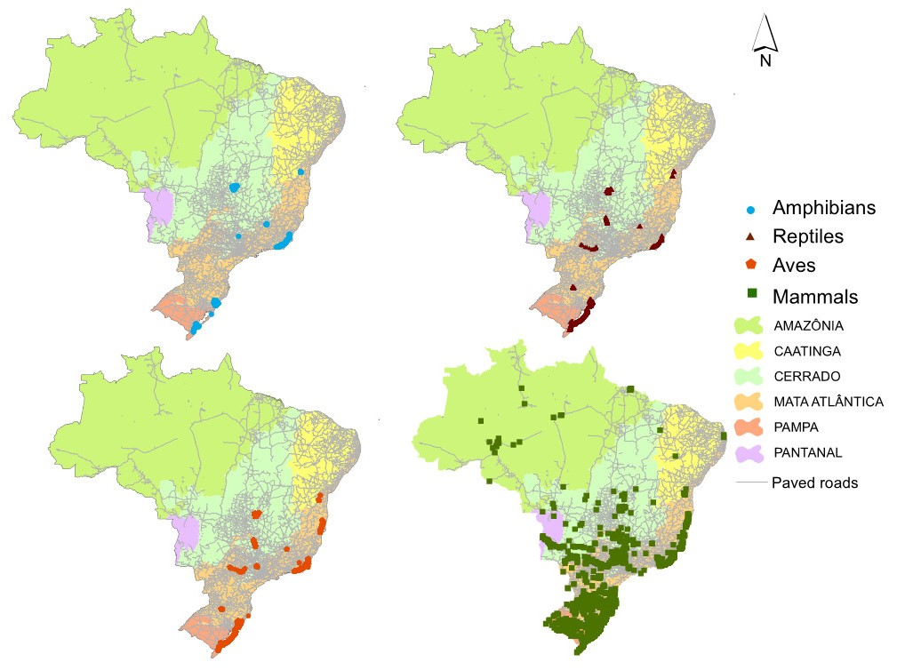

# BRAZIL ROAD-KILL
--------------------------------------------------------

### ***BRAZIL ROAD-KILL – a dataset of wildlife terrestrial vertebrate road-kills***

BRAZIL ROAD-KILL is the first dataset of the <a href="https://github.com/LEEClab/BRAZIL_SERIES">BRAZIL series</a>, on which research teams are compiling biodiversity information within all the Brazil biomes. Brazil road-kill is lead by CLARA GRILO and ANDREAS KINDEL, and counts with the great contribution of a wide range of researchers, consulting and employing people involved on road-kill research, surveys and monitoring within Brazil. The manuscript was published in Ecology as a datapaper:

The dataset was published in Ecology:

Grilo et al. 2018. BRAZIL ROAD-KILL – a dataset of wildlife terrestrial vertebrate road-kills. *Ecology*.

This repository aims at keeping updates on the BRAZIL ROAD-KILL dataset.

### Abstract 

Mortality from collision with vehicles is the most visible impact of road traffic on wildlife. Mortality due to roads (hereafter road-kill) can affect the dynamic of populations of many species and can, therefore, increase the risk of local decline or extinction. This is especially true in Brazil, where plans for road network upgrading and expansion overlaps biodiversity hotspot areas, which are of high importance for global conservation. Researchers, conservationists and road planners face the challenge to define a national strategy for road mitigation and wildlife conservation. The main goal of this dataset is a compilation of geo-referenced road-kill data from published and unpublished road surveys. This is the first datapaper on the BRAZIL SERIES (search by <a href="https://esajournals.onlinelibrary.wiley.com/doi/toc/10.1002/(ISSN)1939-9170.AtlanticPapers">ATLANTIC</a> and NEOTROPICAL series of datapapers within Ecology journal), which aims make public road-kill data for species in the Brazilian Regions. The dataset encompasses road-kill records from 45 personal communications and 26 studies published in peer-reviewed journals, theses and reports. The road-kill dataset comprises 21,512 records, 83% of which are identified to the species level (n = 450 species). The dataset includes records of 31 amphibian species, 90 reptiles species, 229 birds species, and 99 mammals species. One species is classified as Endangered, eight as Vulnerable and twelve as Near Threatened. The species with the highest number of records are: Didelphis albiventris (n = 1,549), Volatinia jacarina (n = 1,238), Cerdocyon thous (n = 1,135), Helicops infrataeniatus (n = 802), and Rhinella icterica (n = 692). Most of the records came from southern Brazil. However, observations of the road-kill incidence for non-Least Concern species are more spread across the country. This dataset can be used to identify which taxa seems to be vulnerable to traffic, analyze temporal and spatial patterns of road-kill at local, regional and national scales and also used to understand the effects of road-kill on population persistence. It may also contribute to studies that aims to understand the influence of landscape and environmental influences on road-kills, improve our knowledge on road-related strategies on biodiversity conservation and be used as complementary information on large-scale and macroecological studies. 

 

<b>Figure 1.</b> Location of road-kill records for amphibians, reptiles, birds and mammals superimposed to Brazilian biome limits and paved road network.

### Contact

Correspondence and requests for materials should be addressed to: **Clara Grilo** (clarabentesgrilo@gmail.com) and Andreas Kindel (andreaskindel@gmail.com).

## CLASS I. DATA SET DESCRIPTORS

### A. Data set identity:

Title: BRAZIL ROAD-KILL – a dataset of wildlife terrestrial vertebrate road-kills

### B. Data set and metadata identification codes:

Brazil_Roadkill_MetadataS1.pdf: metadata document with data descriptions.

Brazil_Roadkill_DataS1.zip: dataset with Brazil_Roadkill_20180527.csv.

## Principal Investigators:

**Clara Grilo**: email [clarabentesgrilo@gmail.com](mailto:clarabentesgrilo@gmail.com)

Setor de Ecologia Aplicada, Universidade Federal de Lavras, Lavras, MG, 37200-000 Brasil. 

**Andreas Kindel**: email [andreaskindel@gmail.com](mailto:andreaskindel@gmail.com)

NERF-UFRGS, Núcleo deEcologia de Rodovias e Ferrovias, Departamento de Biologia, Universidade Federal do Rio Grande do Sul. 96203-900, Brasil.

