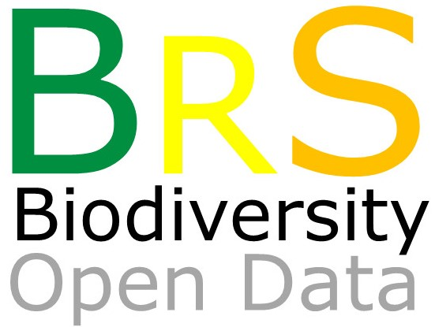

# BRAZIL SERIES: Data on the biodiversity within Brazil
--------------------------------------------------------
### The BRAZIL SERIES aims to make public Biodiversity data for species occurrence, populantion and community levels that occurs in the Brazilian Regions
Brazil is between the most biodiverse regions in the Neotropics, which includes two Biodiversity Hotspots (***ATLANTIC FOREST*** and ***CERRADO***), and 4 biomes with a very high species richness and diversity (***AMAZONIA***, ***CAATINGA***, ***PANTANAL*** and ***PAMPAS***). In this datapaper series we aims to compile all sort of biodivesrity data, from invertebrates to vertebrates, plants, and several ecological processes. 

Join us in this Jorney. 

All data will be available in ECOLOGY repository. This mirror GITHUB repository will maintain updated versions of datasets.

**Mauro Galetti and Milton Cezar Ribeiro**

Coordinators ofthe Atlantic data papers

Universidade Estadual Paulista (UNESP)

Instituto de Biociências, Departamento de Ecologia

13506-900 Rio Claro, São Paulo, Brazil

